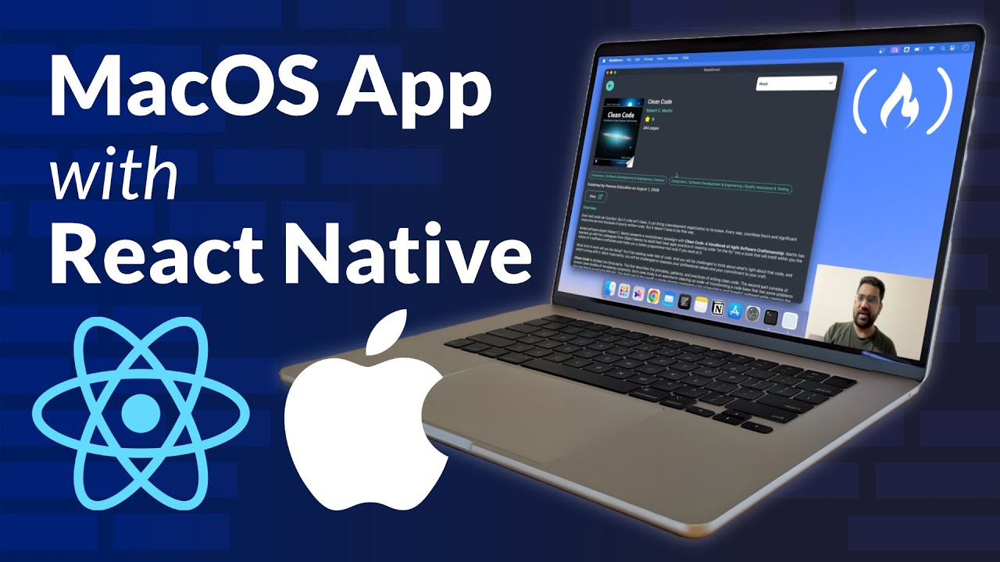
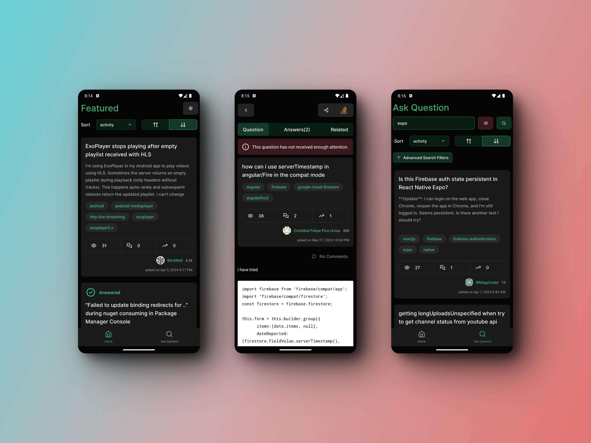

  
  <samp>
    <h1 align="center">Hello there!</h1>
    <h2 align="center">I'm Brijen Makwana</h2>
    
🉠 Featured on <strong><a href="https://youtu.be/-kizZZrh1zM?si=v-9N0wCIutEzoSGO">freeCodeCamp.org YouTube channel</a></strong> for my MacOS app built with React Native!

    
      

  
🉠Watch my video on <strong><a href="https://youtu.be/KCQsP91Wor0?si=-Bxz0RrjXd7v_NgX">freeCodeCamp.org YouTube channel</a></strong> where I teach how to build a mobile app with Lynx framework!

  
   
     
  
💻  I specialize in building Web and Mobile Applications that push the boundaries of what's possible.

     
    
📺  Content contributor to the YouTube channel, <a href="https://www.youtube.com/watch?v=fLanCWsjGrk&list=PLS1QulWo1RIb_tyiPyOghZu_xSiCkB1h4">ProgrammingKnowledge</a>, which has over 1.7 million subscribers! I love creating content that helps people learn and grow their tech skills.

     
    
✍️  I'm also a Technical Content Writer at <a href="https://auth.geeksforgeeks.org/user/brijenMakwana/articles">GeeksforGeeks</a>, where I get to share my knowledge and expertise with a global audience.

     
    
🧑🏻‍🏫  As a Content Mentor at <a href="https://www.geeksforgeeks.org/videos/quiz-application-in-react-native-with-expo-cli/">GeeksforGeeks</a>, I work one-on-one with aspiring developers, helping them to reach their full potential.

     
    
📱  Download my Stack Overflow app <strong><a href="https://play.google.com/store/apps/details?id=com.brijenmakwana.BugBridger&pcampaignid=web_share">Bug Bridger</a></strong>, available on Play Store

    
      

📚  Read my book <strong><a href="https://www.amazon.com/dp/B0BP83H43T/ref=sr_1_1?crid=3SMKDCSQYS8KG&keywords=react+hook+101&qid=1670392435&sprefix=react+hook+101%2Caps%2C251&sr=8-1">React Hooks 101</a></strong>, available on Amazon 📕

    
  </samp>

  <samp>
    
Fun Fact: I'm a Kindle reader, Xbox gamer, and MCU fan!

  </samp>

